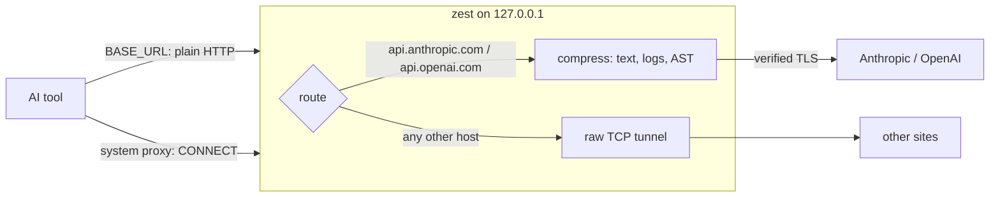

<div align="center">


# ⚡ zest

*Ultra-fast, zero-config local prompt compression proxy for LLM workflows.*

[](https://www.rust-lang.org)
[](LICENSE)
[](https://github.com/Asstryvenn/zest/releases)
[](https://github.com/Asstryvenn/zest/actions/workflows/release.yml)

```
[zest] 15,939 -> 722 tokens (-95.5%) | Saved: ~$0.076 | Latency: 2.8ms claude-opus-5 /v1/messages
```

</div>

## Overview

zest is a token compression engine written in Rust that runs on your own machine at `127.0.0.1`.
It sits between your AI tools and the Anthropic or OpenAI API. Before a request leaves your computer,
it strips the parts that cost tokens without carrying meaning: terminal noise, repeated log lines,
framework stack frames, and function bodies nobody asked about. Everything else, including your API
key and the response stream, passes through unchanged.

- **🔥 Up to 95% context compression:** Tree-sitter reduction of Python and TypeScript/JavaScript,
  regex log and traceback pruning, and deterministic cleaning. Measured: −95.6% on a 16k-token CI log,
  −59% on a Python module, −60% on a TypeScript module, in a few milliseconds per request.
- **🛡️ 100% local processing:** no zest servers and no telemetry. Compression runs in memory on your
  machine, and requests go straight to the provider you were already using.
- **🌐 System-wide MITM proxy (macOS):** optional interception of `api.anthropic.com` and
  `api.openai.com` only, using a local root CA locked to those two hosts with X.509 name constraints.
- **🎨 Interactive TUI onboarding:** `zest init` walks you through setup in Russian or English, guided by
  Zesty, the blue-fire spirit.
- **⚡ No pass-through overhead:** traffic to any other host goes through a raw TCP tunnel. zest never
  decrypts, parses or logs it.

## App compatibility

| Category | Apps | How they connect | Status |
|---|---|---|---|
| **Terminal & CLI** | `claude` (Claude Code) | `ANTHROPIC_BASE_URL` (base-URL mode) | ✅ Supported |
| | Custom Python / Node.js scripts using the official Anthropic or OpenAI SDKs | `ANTHROPIC_BASE_URL` / `OPENAI_BASE_URL` | ✅ Supported |
| | Aider, OpenHands | Their own API base-URL setting | 🧪 Should work; not yet tested |
| **IDE extensions** | VS Code: Cline, Continue, Roo Code | Base-URL setting in the extension, or system proxy mode | ✅ Supported path; per-extension setup varies |
| | Cursor with your own API key | Cursor's servers make the call, and they can't reach `127.0.0.1` | ⚠️ Not supported |
| **Subscription apps** | claude.ai, chatgpt.com, Claude Desktop, ChatGPT Desktop, Cursor's built-in AI | Their own endpoints, not the public APIs, and possibly certificate pinning | ❌ Excluded by design |

✅ means the connection path is covered by zest's test suite. 🧪 means the tool supports a custom base URL
but hasn't been tried with zest yet.

## Architecture



- **Stack:** Rust with `tokio` and `hyper` for the proxy, `rustls` and `tokio-rustls` for TLS, `rcgen`
  for certificates, `tree-sitter` for code, and `reqwest` for upstream calls.
- **Security:** the local **Zest Root CA** carries critical X.509 name constraints that permit only
  `api.anthropic.com` and `api.openai.com`, so it can't be used to intercept any other domain, even if
  its key leaked. The key is stored owner-only (0600) and never leaves your machine. Upstream connections
  are fully certificate-verified, and zest never routes its own traffic through a proxy.
- **Cache-safe:** compression is a pure function of each message's own content, so the rewritten
  conversation is byte-identical on every request. Provider prompt caches stay warm, and signed thinking
  blocks stay valid.

## Quick start

**1. Interactive setup:** language, compression mode, port, shell variables and editor tips.

```bash
zest init
```

**2. Run the local server.** It uses the mode and port you chose, otherwise `balanced` on `8080`.

```bash
zest serve
```

**3. Connect your tools with base-URL mode.** `zest init` can add these lines to your shell profile for you.

```bash
export ANTHROPIC_BASE_URL=http://127.0.0.1:8080
export OPENAI_BASE_URL=http://127.0.0.1:8080/v1
```

**4. Optional (macOS): switch to the system proxy.** No per-app settings are needed. It trusts the local
CA once, which asks for your password.

```bash
zest mode system    # enable: `zest serve` then manages the macOS proxy
zest mode cli       # back to base-URL mode, previous proxy settings restored
```

zest also works as a pipe:

```bash
cat build.log | zest                                     # compressed log to stdout, stats to stderr
zest --mode max src/service.py                           # collapse function bodies
```

## Install

Prebuilt binaries are attached to every [release](https://github.com/Asstryvenn/zest/releases).

<details open>
<summary><b>macOS</b> (Apple Silicon and Intel)</summary>

```bash
# Apple Silicon; for Intel use zest-x86_64-apple-darwin
curl -L https://github.com/Asstryvenn/zest/releases/latest/download/zest-aarch64-apple-darwin.tar.gz | tar xz
sudo mkdir -p /usr/local/bin && sudo mv zest-aarch64-apple-darwin/zest /usr/local/bin/
```

The binaries are not code-signed. If you downloaded the archive with a browser instead of `curl`, clear
the quarantine flag once: `xattr -d com.apple.quarantine /usr/local/bin/zest`.

</details>

<details>
<summary><b>Linux</b> (x86_64)</summary>

```bash
curl -L https://github.com/Asstryvenn/zest/releases/latest/download/zest-x86_64-unknown-linux-gnu.tar.gz | tar xz
sudo mv zest-x86_64-unknown-linux-gnu/zest /usr/local/bin/
```

</details>

<details>
<summary><b>Windows</b> (x86_64, PowerShell)</summary>

```powershell
Invoke-WebRequest https://github.com/Asstryvenn/zest/releases/latest/download/zest-x86_64-pc-windows-msvc.zip -OutFile zest.zip
Expand-Archive zest.zip -DestinationPath .
.\zest-x86_64-pc-windows-msvc\zest.exe init
```

</details>

<details>
<summary><b>Cargo / from source</b></summary>

```bash
cargo install --git https://github.com/Asstryvenn/zest
# or
git clone https://github.com/Asstryvenn/zest && cd zest && cargo build --release
```

</details>

Each archive has a `.sha256` file next to it for verification.

## How compression works

Every text block in `system`, `messages[].content` and tool results goes through four tiers. Tool calls,
images, thinking blocks and `cache_control` markers are never modified.

| Tier | What it does | Modes |
|---|---|---|
| 1. Noise | Strips ANSI and control characters, keeps the last frame of `\r` progress bars, trims whitespace, and collapses runs of identical lines (`[ZEST: previous line repeated 499 more times]`) | all |
| 1. Filler | Removes greetings and "could you please…" from human prose (never inside backticks or quotes, and never down to an empty message) | balanced, max |
| 2. AST | Tree-sitter collapses function bodies to `...  # zest: N lines hidden`. Keeps imports, types, classes, signatures, docstrings, constructors and every function the message names | balanced\*, max |
| 3. Logs | Drops INFO/DEBUG noise (unless it mentions errors, or you ask for debug logs), folds runs of passing tests, and trims stack traces to the innermost frames plus your own code | balanced, max |
| 4. Safety | Code only changes by whole lines inside function bodies, so string literals, SQL and JSON are never cut. Every collapse is re-parsed. If the API rejects a rewritten body (400), the original is sent instead | all |

\* In **balanced** mode, code is only collapsed when your message names a target (`` `reserve_stock` ``, a
file, a traceback frame). Everything you didn't name is shortened, and with no target the code is left alone.

| `--mode` | Use it when |
|---|---|
| `safe` | You want zero semantic risk: only whitespace, ANSI and exact duplicates change |
| `balanced` (default) | Coding agents and chat: big wins on logs, and code shrinks only when the target is clear |
| `max` | Read-heavy agents that mostly need structure, not function bodies |

Measured on the fixtures in [`tests/fixtures/`](tests/fixtures):

| Input | safe | balanced | max |
|---|---|---|---|
| `ci_run.log`: pytest + app logs + Django traceback (16k tokens) | −15.8% | −95.6% | −96.2% |
| `inventory_service.py`, unfenced (1.1k tokens) | 0% | 0% | −58.7% |
| `orders.ts`, unfenced (0.9k tokens) | 0% | 0% | −60.3% |

Token counts use the o200k BPE, so treat absolute numbers as estimates; the before/after ratio is
consistent. The `$` figure uses list input prices and ignores cache discounts, so it's an upper bound.

## System-wide mode (macOS)

<details>
<summary><b>What <code>zest mode system</code> does, step by step</b></summary>

1. **Root CA:** `zest cert install` creates **Zest Root CA** in `~/.config/zest/certs/` (the key file is
   0600) and runs `sudo security add-trusted-cert -d -r trustRoot -k /Library/Keychains/System.keychain rootCA.pem`.
2. **System proxy:** `zest serve` saves every enabled network service's proxy settings to
   `~/.config/zest/system-proxy.json`, then points their HTTP and HTTPS proxies at zest with `networksetup`.
   It prints `[zest] System Proxy: ACTIVE (api.anthropic.com, api.openai.com)`.
3. **Interception:** `CONNECT api.anthropic.com:443` and `CONNECT api.openai.com:443` are decrypted with a
   certificate from the local CA, compressed, and re-sent to the real API over verified TLS. Every other
   host is a raw tunnel.
4. **Restore:** Ctrl+C, `kill`, closing the terminal, or a panic restores the saved settings. After a hard
   kill (`kill -9`, power loss), run `zest system-proxy off`.

</details>

<details>
<summary><b>Caveats</b></summary>

- **Own certificate lists:** tools that ship their own list (Python `requests`/`httpx` with certifi, Java,
  Firefox) may follow the system proxy but not trust the System keychain, so calls to the two API hosts
  fail with a certificate error while system mode is on. Use base-URL mode for those tools. For Node, you
  can add the CA with `NODE_EXTRA_CA_CERTS=~/.config/zest/certs/rootCA.pem`.
- **Node.js CLIs:** Claude Code and other Node tools ignore the macOS proxy setting. Keep them on base-URL mode.
- **`on` safety check:** `zest system-proxy on` refuses unless zest is running, because a proxy pointing at
  nothing would cut off your internet.
- **No unattended changes:** commands that change system settings answer "no" without a terminal unless
  you pass `--yes`.

</details>

```bash
zest cert status                     # CA path, SHA-256, whether macOS trusts it
zest system-proxy on | off | status
zest serve --mitm                    # interception only; apps opt in with HTTPS_PROXY
zest cert remove                     # untrust and delete the CA
```

On Linux and Windows, `zest serve --mitm` with `HTTPS_PROXY=http://127.0.0.1:8080` works, but trusting the
CA and switching the system proxy are manual. `zest cert install` prints the commands to run.

## Reference

<details>
<summary><b>Proxy routes</b></summary>

| Request | Behaviour |
|---|---|
| `POST /v1/messages`, `/v1/messages/count_tokens` | Anthropic format, compressed, sent to `--anthropic-upstream` |
| `POST */chat/completions` | OpenAI format, compressed, sent to `--openai-upstream` |
| Any other path | Passed through unchanged. Requests with `anthropic-version` or `x-api-key` go to Anthropic, everything else to OpenAI |
| `CONNECT api.anthropic.com:443`, `CONNECT api.openai.com:443` | With interception on: TLS terminated locally, compressed, re-sent to the real API |
| `CONNECT` to any other host | Raw TCP tunnel |
| `GET http://host/...` (absolute URL) | Plain HTTP proxying, unchanged |
| `GET /zest/stats`, `GET /zest/health` | Session totals as JSON, and `ok` |

Responses, including SSE streams, are streamed back without buffering.

</details>

<details>
<summary><b>Configuration</b></summary>

`zest init` and `zest mode` save your choices to `~/.config/zest/config.toml` (on Windows,
`%APPDATA%\zest\config.toml`; override with `$ZEST_CONFIG`). Command-line flags always win. The
shell-profile block `zest init` writes sits between `# >>> zest >>>` and `# <<< zest <<<`, and running
setup again replaces it. Set `NO_COLOR=1` for plain output.

</details>

<details>
<summary><b>Project layout</b></summary>

```
src/
├── main.rs               CLI: serve, init, compress, cert, system-proxy, mode
├── onboarding.rs         zest init: bilingual guided setup with Zesty
├── cli_system.rs         cert / system-proxy / mode commands
├── certs.rs              name-constrained Zest Root CA, leaf certificates, keychain trust
├── sysproxy.rs           macOS networksetup: save, enable, restore
├── platform.rs           command runner (sudo-aware; faked in tests)
├── config.rs             ~/.config/zest/config.toml
├── proxy/server.rs       accept loop, routing, forwarding, 400 fallback
├── proxy/mitm.rs         CONNECT: TLS interception or raw tunnel
├── proxy/handlers.rs     OpenAI / Anthropic JSON rewriting
├── compressor/           engine, ast (tree-sitter), logs, text
└── tui/                  stats readout, theme, Zesty banner
tests/                    compression, proxy, mitm (CA, name constraints, tunnels)
```

</details>

## Development

```bash
cargo test
```

Pushing a `v*` tag builds macOS (ARM64 and Intel), Linux x86_64 and Windows x86_64 binaries and attaches
them, with SHA-256 checksums, to a GitHub release:

```bash
git tag v0.2.0 && git push origin v0.2.0
```

**Not yet done:** tree-sitter grammars beyond Python and TS/JS (other languages are detected and left
intact), compression for OpenAI's `/v1/responses` API, and a full-screen stats dashboard.

## License

[MIT](LICENSE)
